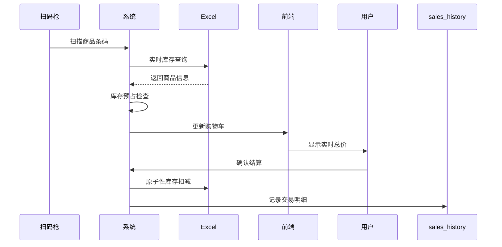

# 商品库存管理系统

基于Python和Streamlit构建的零售业库存管理解决方案，支持扫码录入、实时库存管理、销售分析等功能。

## 📋 功能特性

### 1. 核心功能
- **扫码销售模式**
  - 实时库存校验与预占机制
  - 智能合并同类商品
  - 事务性库存扣减（结算时生效）
  - 购物车管理（数量调整/删除）

- **扫码入库模式**
  - 现有商品库存追加
  - 新商品自动登记
  - 必填字段验证
  - 拼音码自动生成

- **销售历史分析**
  - 时间范围筛选（默认最近30天）
  - 双维度可视化（销售额/利润）
  - CSV数据导出
  - 日粒度趋势分析

### 2. 技术亮点
- **实时响应**：毫秒级库存状态更新
- **健壮性**：双重库存校验机制（购物车/结算）
- **扩展性**：模块化设计支持功能扩展
- **兼容性**：适配主流扫码枪设备

## 🛠️ 技术栈
| 组件 | 用途 | 版本 |
|------|------|------|
| Streamlit | GUI框架 | ≥1.22 | 
| Pandas | 数据处理 | ≥1.5 |
| openpyxl | Excel交互 | ≥3.0 |
| xpinyin | 拼音码生成 | ≥0.7 |

## 🚀 快速启动

### 环境配置
```bash
# 1. 克隆仓库
git clone https://github.com/Yingyi11/Simple_Shop.git

# 2. 安装依赖
pip install streamlit pandas openpyxl xpinyin
```

### 数据准备
在项目根目录创建(格式如给定示例文件)：
- `商品资料.xlsx`（商品主数据）
- `销售历史.xlsx`（自动生成，首次运行可空）

### 启动系统
```bash
streamlit run inventory_management.py
```

## ⚙️ 工作流程

### 典型销售场景


## ⚠️ 注意事项
1. **设备配置**
   - 扫码枪需设置为**自动回车**模式
   - 禁用Excel文件自动打开锁定

2. **数据安全**
   - 建议每日定时备份`*.xlsx`文件
   - 生产环境建议迁移至数据库

3. **性能优化**
   - 单Excel文件记录建议≤1万条
   - 定期清理历史数据

## 📜 许可证
MIT License
